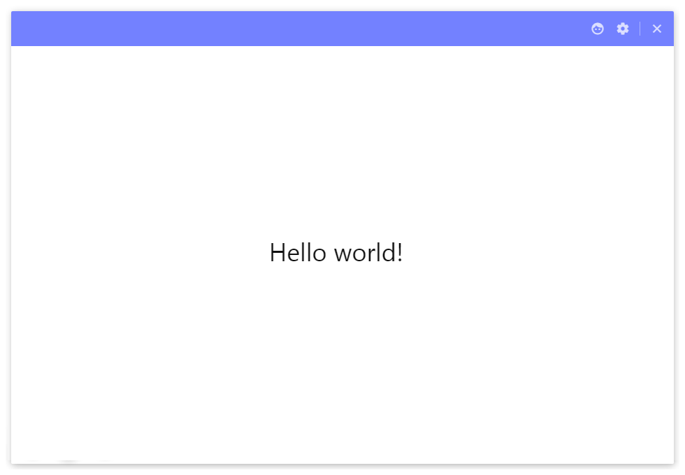

## 如何自定义窗口的阴影效果？
这是一个看似简单又很难完成的问题。因为窗口是系统自带的，每个平台系统都有不同的窗口效果。在 Mac 上会有阴影效果，在 Window 上没有阴影效果，在 Linux 上阴影效果还要看情况。

总之，对于 Electron 开发来说想要自定义窗口的阴影效果，就需要把原生自带的窗口去除，自己动手来画一个。

以下是笔者经过一番研究之后得出的阴影效果，并且在所有平台都有统一的外观。



那么想定制这种窗口，该如何做？

### 多则删，少则补
首先第一步，把窗口的原生窗口去掉。

```js
mainWindow = new BrowserWindow({
    height: 680,
    width: 980,
    useContentSize: true,
    frame: false,                   // 边框
    transparent: true,              // 背景透明
});
```

这时得到了是一个无边框的窗体。如果你把 html 设置为背景透明，那么就是一个透明的窗口，可以利用这点来自定义窗口的阴影效果。


```html
<html>
<body>
    <div id="main">

    </div>
</body>
</html>
```

原理就是 html, body 设置为 flex 布局，并设置一定的 padding。

```css
html, body {
    font-family: Tahoma, Geneva, Verdana, sans-serif;
    font-size: 16px;
    color: #222;
    padding: 8px;
    margin: 0;
    display: flex;
    height: 100%;
    width: 100%;
    overflow: hidden;
    background-color: transparent;
}
```

接着在 main 里设置充满整个容器，并设置阴影效果。

```css
#main {
    box-shadow:
        0 0 16px rgba(115, 129, 255, 0.54),
        0 0 6px rgba(1, 1, 1, 0.06);
    background-color: #fff;
    flex: 1;
    cursor: default;
    border-radius: 2px;
    width: 100%;
    overflow: auto;         // 滚动条
}
```

这是的窗体就是一个带有阴影效果的。实际上看到的阴影效果是 div#main 的阴影。而 html, body 背景设置为透明了。


### 注意的地方

