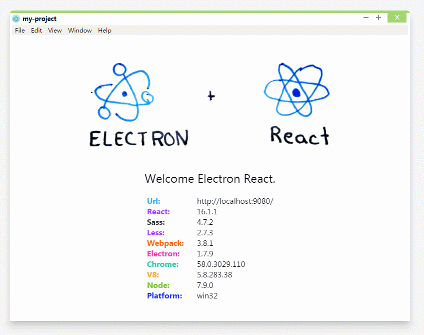

## 如何解决拖拽图片导致 url 重定向的问题？
当你随便拖拽一个文件到 Electron 的窗口时，Electron 的 URL 的重定向到本地 URL。

主要的问题，如下图所表现的。



（如果生成环境的应用是这样，那就尴尬了）

### 解决方法
这个问题是 chrome 自带的一个默认的拖拽行为，即每个 div（或其他元素）都一个 ondrag，ondrop 等事件来捕获拖拽的行为。


解决的方法就是：**阻止默认行为。**

为页面的 document 添加以下事件：

```js
document.ondrop      =
document.ondragover  =
document.ondragleave =
document.ondragenter = event => {
    event.preventDefault();
}
```

如果拖拽到某个 div 的上方，通过事件冒泡，冒泡到 document 时进行拦截，这样就不会触发浏览器的默认行为。

好，到这里问题已经解决了。